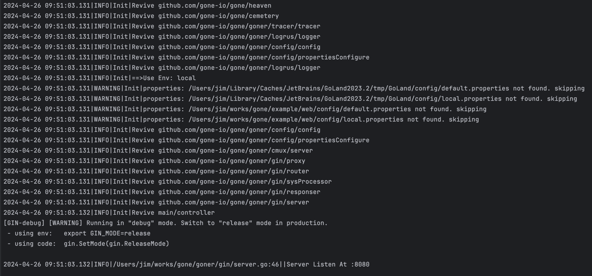
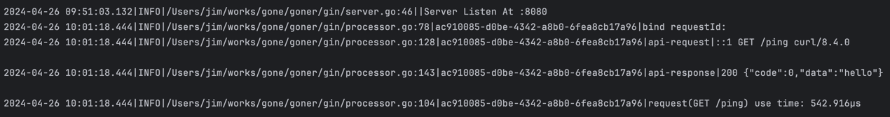

<p align="left">
   English&nbsp ｜&nbsp <a href="README_CN.md">中文</a>
</p>
<br><br>

# gone framework  [](LICENSE)  [](http://godoc.org/github.com/gone-io/gone)
The most Spring programmer-friendly Golang framework, dependency injection, integrates Web.


## Quick Start

### 1. Example of DI [code](example/di/main.go)

```go
package main

import "github.com/gone-io/gone"

type AGoner struct {
	gone.Flag //tell the framework that this struct is a Goner
	Name      string
}

func (g *AGoner) Say() {
	println("I am the AGoner, My name is", g.Name)
}

type BGoner struct {
	gone.Flag         //tell the framework that this struct is a Goner
	a         *AGoner `gone:"*"` //Gone Tag `gone` tell the framework that this field will be injected by the framework
}

// AfterRevive executed After the Goner is revived; After `gone.Run`, gone framework detects the AfterRevive function on goners and runs it.
func (g *BGoner) AfterRevive() gone.AfterReviveError {
	g.a.Say()

	return nil
}

// Priest Responsible for putting Goners that need to be used into the framework
func Priest(cemetery gone.Cemetery) error {
	cemetery.Bury(&AGoner{Name: "Injected Goner"})
	cemetery.Bury(&BGoner{})
	return nil
}

func main() {

	// start gone framework
	gone.Run(Priest)
}
```

Run the above code, and the screen will print: "I am the AGoner, My name is Injected Goner".

### 2. Example of Web Service [code](example/web/main.go)
```go
package main

import (
	"github.com/gone-io/gone"
	"github.com/gone-io/gone/goner"
	"github.com/gone-io/gone/goner/gin"
)

type controller struct {
	gone.Flag
	router gin.IRouter `gone:"gone-gin-router"` //inject gin router Goner, which is wrapped of `gin.Engine`
}

// Mount use for  mounting the router of gin framework
func (ctr *controller) Mount() gin.MountError {
	ctr.router.GET("/ping", func(c *gin.Context) (any, error) {
		return "hello", nil
	})
	return nil
}

func NewController() gone.Goner {
	return &controller{}
}

func Priest(cemetery gone.Cemetery) error {
	//Load the Goner of the gin web framework into the system
	_ = goner.GinPriest(cemetery)

	//Load the business Goner
	cemetery.Bury(NewController())
	return nil
}

func main() {
	
	//Gone.Server is used to start a service, and the program will block until the service ends.
	gone.Serve(Priest)
}

```
Run the code, it will listen on port 8080, and the screen will print:


Test http request:
```bash
curl http://localhost:8080/ping
```
You  will get the response:
```json
{"code":0,"data":"hello"}
```
And prints on the screen:



## The story of the Gone framework
> The word "gone" in English can mean "left," "departed," "absent," "missing," or "dead." Therefore, those managed by the Gone framework are referred to as "Goners".  
> There exists a mysterious graveyard where the "Goners" are laid to rest, and their souls 😇 ascend to heaven. Only the designated priests of heaven can bury the "Goners" in the graveyard...  
> The gates of heaven are slowly opening...


### Concept

- [Heaven](https://pkg.go.dev/github.com/gone-io/gone#Heaven):  🕊☁️,The running program.
- Heaven.Start: Means the program starts to run；Goner lives forever until the heaven end (the program terminates).
- Heaven.Stop: The heaven end; the program terminates.
- [Cemetery](https://pkg.go.dev/github.com/gone-io/gone#Cemetery): 🪦, Graveyard, Used to manage Tomb.
- Cemetery.Bury: Put Goner in Tomb and bury him in the graveyard.
- Cemetery.revive: Resurrect the Goner and elevate it to heaven; for the Goner, it signifies the completion of attribute injection (or assembly).
- [Tomb](https://pkg.go.dev/github.com/gone-io/gone#Tomb): ⚰️，The place where the Goner is buried；Which is a container for the Goner, and the Goner can be injected into other Goner.
- [Priest](https://pkg.go.dev/github.com/gone-io/gone#Priest):  ✝️，A special function responsible for burying the Goner.
- [Goner](https://pkg.go.dev/github.com/gone-io/gone#Goner): 💀, A interface, which is an abstraction of injectable objects: can inject other Goner, can be injected by other Goner.
- [Prophet](https://pkg.go.dev/github.com/gone-io/gone#Prophet): A interface, If a Goner is a `Prophet`, after being resurrected, `AfterRevive() gone.AfterReviveError` will be executed.
- Prophet.AfterRevive: A function, which allows Prophet to regain control of the program after resurrection. It is crucial that the execution of this function occurs swiftly, without causing any program interruptions. "The key to glimpsing heaven can only be temporary."
- [Angel](https://pkg.go.dev/github.com/gone-io/gone#Angel): 𓆩♡𓆪 ，Both `Start (gone.Cemetery) error` and `Stop (gone.Cemetery) error` methods need to be implemented at the same time, just like angel wings.
- Angel.Start: A function. Angel left wing, which means to start work; which can be used to start some long-running service goroutines.
- Angel.Stop: A function. Angel right wing means the end of work. which can be used to send a stop signal to the service goroutines and clean up some resources.
- [Vampire](https://pkg.go.dev/github.com/gone-io/gone#Vampire): 🧛🏻‍，The Goner that implements `Suck(conf string, v reflect.Value) gone.SuckError` is termed as Vampire. Objects that are not classified as Goner can be injected into the Goner property through the `Suck` method. A vampire is an ominous entity that might annihilate the entire kingdom of heaven. Although the blood-sucking behavior can alter the standard behavior of dependency injection and add new features to the framework, it may also introduce circular dependencies, potentially harming the system.
- Vampire.Suck: A function. Vampire "bloodsucking behavior"; before a vampire is injected into the Goner, its "bloodsucking behavior" is triggered so that it can allow other objects to inject into the Goner rather than itself.

### Four kinds of Goner.

- `Goner`
> ordinary Goner, which can be used to abstract Service, Controller, Client and other common components in program.

- Prophet `Goner`
> The method **`AfterRevive (Cemetery, Tomb) ReviveAfterError`**, it will be called after ascending to the Kingdom of Heaven.
>
> **example:** [urllib](goner/urllib/req.go), a Goner that comes with the framework, which encapsulates `github.com/imroc/req/v3`, for sending http requests.

- Angel `Goner`
> Angels will assume certain responsibilities in heaven: in the start phase, the angel's `Start` method will be called; in the stop phase, the angel's `Stop` method will be called; Therefore, angels are suitable for abstracting components which need to be started and to be stopped.
>
> **example:** [xorm](goner/xorm/implement.go), a Goner that comes with the framework, which encapsulates `xorm.io/xorm`, for connecting mysql server.

- Vampire `Goner`
> Vampires, who have the ability to suck blood, can read / write marked fields through the `Suck` method, and can abstract the behavior of certain attributes of other components.
>
> **example:** [config](goner/config/config.go), a Goner that comes with the framework, for injecting config values in config files to Goner Attributes.

