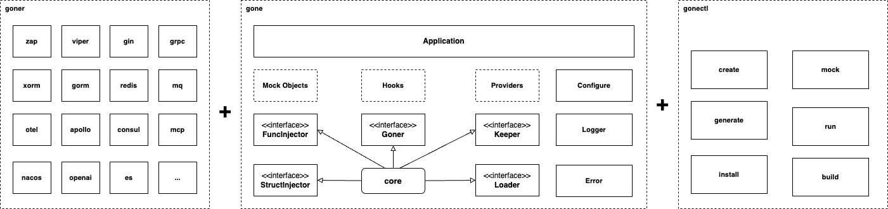
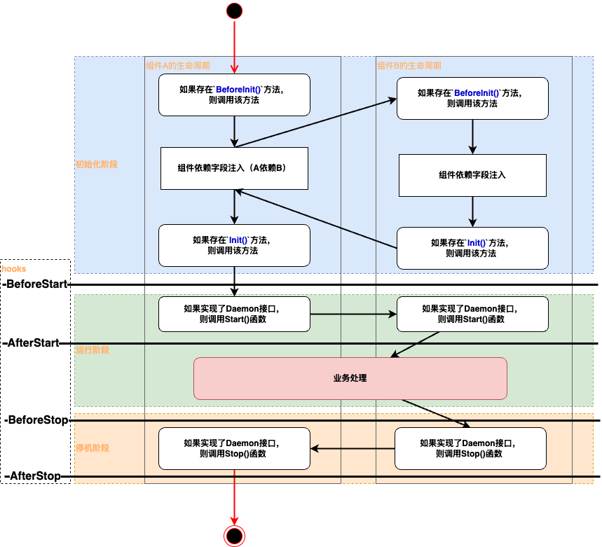

<p align="left">
    <a href="README.md">English</a>&nbsp ｜&nbsp 中文
</p>

[](LICENSE)
[](https://pkg.go.dev/github.com/gone-io/gone/v2)
[](https://goreportcard.com/report/github.com/gone-io/gone)
[](https://codecov.io/gh/gone-io/gone)
[](https://github.com/gone-io/gone/actions/workflows/go.yml)
[](https://github.com/gone-io/gone/releases)
[](https://github.com/avelino/awesome-go)


- [Gone](#gone)
  - [Gone 是基于Golang标签的依赖注入框架](#gone-是基于golang标签的依赖注入框架)
  - [特性](#特性)
    - [架构](#架构)
    - [生命周期](#生命周期)
  - [快速开始](#快速开始)
  - [更新记录](#更新记录)
    - [v2.0.5](#v205)
    - [v2.0.4](#v204)
    - [v2.0.3](#v203)
    - [v2.0.0](#v200)
    - [v1.2.1](#v121)
    - [v1.2.0](#v120)
    - [v1.1.1](#v111)
  - [贡献](#贡献)
  - [联系方式](#联系方式)
  - [许可证](#许可证)


# Gone

## Gone 是基于Golang标签的依赖注入框架

Gone 是一个轻量级的golang依赖注入框架，下面是一个简单的例子(嵌入了gone.Flag的结构体，我们称之为Goner)：

```go
package main

import "github.com/gone-io/gone/v2"

type Dep struct {
	gone.Flag
	Name string
}

type Component struct {
	gone.Flag
	dep *Dep        `gone:"*"` //依赖注入
	log gone.Logger `gone:"*"`
}

func (c *Component) Init() {
	c.log.Infof(c.dep.Name) //使用依赖
}

func main() {
	gone.
		NewApp().
		// 组件注册加载
		Load(&Dep{Name: "Component Dep"}).
		Load(&Component{}).
		//运行
		Run()
}
```

## 特性

- 支持结构体属性的注入，支持私有字段注入 [👉🏻依赖注入介绍](docs/inject.md)
- 支持函数参数的注入，按函数参数类型注入  [👉🏻依赖注入介绍](docs/inject.md)
- Provider机制，支持将外部组件注入到Goner中: [👉🏻Gone V2 Provider 机制介绍](docs/provider.md)
- 支持代码生成，自动完成组件注册加载（通过[Gonectr](https://github.com/gone-io/gonectr)完成）
- 支持基于接口mock的单元测试
- 支持微服务开发的相关[Goner组件](https://github.com/gone-io/goner)
- 支持给Goner定义初始化方法`Init()` 和 `BeforeInit()`
- 支持编写服务类型的Goner：实现 `Start() error` 和 `Stop() error`，框架会自动调用Start()和Stop()方法。
- 支持`BeforeStart`、`AfterStart`、`BeforeStop`、`AfterStop`等钩子函数，用于在服务启动和停止时执行自定义操作。

### 架构


### 生命周期


## 快速开始

1. 安装 [gonectr](https://github.com/gone-io/gonectr) 和 [mockgen](https://github.com/uber-go/mock/tree/main)
    ```bash
    go install github.com/gone-io/gonectr@latest
    go install go.uber.org/mock/mockgen@latest
    ```
2. 创建一个项目
    ```bash
    gonectr create myproject
    ```
3. 运行项目
    ```bash
    cd myproject
    go mod tidy
    gonectr run ./cmd/server
    ```

## 更新记录
### v2.0.5
- 新增 `option:"lazy"`标签，用于支持字段的延时注入，参考[文档](docs/lazy_fill.md)
- 注意：使用`option:"lazy"`标记的字段在`Init`、`Provide`、`Inject`这几个方法中不能使用；

### v2.0.4
- 新增 SetValue 函数，用于统一处理各种类型的配置值
- 重构原有的类型处理逻辑，使用反射提高通用性

### v2.0.3
- 新增 `option:"allowNil"`标签，支持[优雅处理可选依赖](docs/allow_nil.md)
- 完善测试和文档

### v2.0.0
v2版本做了大量更新，去掉不必要的概念，使用前请参考：[Gone@v2 使用说明](./docs/v2-update.md) 和 [Gone 从 v1 到 v2 的更新分析](./docs/gone-v1-to-v2-analysis.md)

### v1.2.1

- 定义 **gone.Provider**，一个工厂函数用于将 不是 **Goner** 的外部组件（结构体、结构体指针、函数、接口）注入到 属性需要注入的Goner；
- 修复 `gone.NewProviderPriest` 无法为 生成接口类型的**gone.Provider**生成Priest;
- 为`goner/gorm`编写测试代码，补齐其他测试代码；文档更新。

### v1.2.0

- 提供一种新的 `gone.GonerOption`，可以将按类型注入，将构造注入类型实例的任务代理给一个实现了
  `Suck(conf string, v reflect.Value, field reflect.StructField) error`的**Goner**；
- 提供了一个用于实现**Goner Provider**的辅助函数：
  `func NewProviderPriest[T any, P any](fn func(tagConf string, param P) (T, error)) Priest` ；
- 给`goner/xorm` 集群模式提供策略配置的方案；
- 完善`goner/gorm`代码 和 做功能测试，支持多种数据库的接入。

### v1.1.1

- goner/xorm 支持集群 和 多数据库，最新文档：https://goner.fun/zh/references/xorm.html
- 新增 goner/gorm，封装`gorm.io/gorm`，用于数据库的访问，暂时只支持mysql，完善中...

## 贡献

如果您发现了错误或有功能请求，可以随时[提交问题](https://github.com/gone-io/gone/issues/new)
，同时欢迎[提交拉取请求](https://github.com/gone-io/gone/pulls)。

## 联系方式

如果您有任何问题，欢迎通过以下方式联系我们：

- [Github 讨论](https://github.com/gone-io/gone/discussions)
- 扫码加微信，暗号：gone

  

## 许可证

`gone` 在 MIT 许可证下发布，详情请参阅 [LICENSE](./LICENSE) 文件。