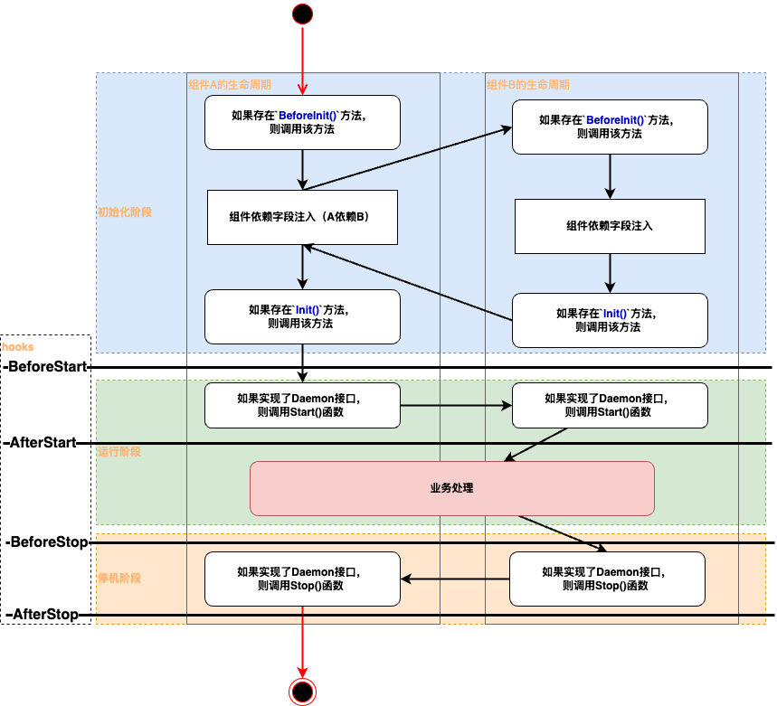

<p>
   English&nbsp ｜&nbsp <a href="v2-update_CN.md">中文</a>
</p>

# Gone v2 User Guide

- [Gone v2 User Guide](#gone-v2-user-guide)
	- [Definition of Goner](#definition-of-goner)
	- [Goner Loader](#goner-loader)
		- [Loading Goners](#loading-goners)
		- [Loading Functions](#loading-functions)
		- [Loading Options](#loading-options)
	- [Dependency Injection](#dependency-injection)
		- [Type-Based Field Injection](#type-based-field-injection)
		- [Name-Based Goner Injection](#name-based-goner-injection)
		- [Injecting Dependencies into Components via Provider](#injecting-dependencies-into-components-via-provider)
	- [Goner Lifecycle](#goner-lifecycle)
	- [Four Hook Functions](#four-hook-functions)
	- [Application](#application)
	- [GonerKeeper](#gonerkeeper)
	- [Array Injection](#array-injection)
	- [Using FuncInjector to Implement Function Parameter Injection](#using-funcinjector-to-implement-function-parameter-injection)
	- [Built-in `Config` and `Logger`](#built-in-config-and-logger)
		- [Config](#config)
		- [Logger](#logger)


## Definition of Goner

A Goner is a component defined by the Gone framework, which is a struct pointer embedded with `gone.Flag`. It can be used for dependency injection in the Gone framework. The following code defines a simple Goner:

```go
package demo

import "github.com/gone-io/gone"

type Component struct {
	gone.Flag
}

var aGoner = &Component{}
```

## Goner Loader

The core of the Gone framework is a Goner repository. The loader's purpose is to register (or load, which we'll refer to as "loading" throughout this document) user-defined components (Goners) into the repository for subsequent dependency injection.

### Loading Goners

```go
package main

import "github.com/gone-io/gone"

func main() {
	type Dep struct {
		gone.Flag
		Name string
	}

	// Load a Dep
	gone.Load(&Dep{})

	// Load a Dep named "dep1"
	gone.Load(&Dep{}, gone.Name("dep1"))

	// Support for chained calls
	gone.
		Load(&Dep{}, gone.Name("dep3")).
		Load(&Dep{}, gone.Name("dep2"))

	// Batch loading through a loading function
	gone.Loads(func(loader gone.Loader) error {
		err := loader.Load(&Dep{}, gone.Name("dep4"))
		if err != nil {
			return gone.ToError(err)
		}
		err = loader.Load(&Dep{}, gone.Name("dep5"))

		return err
	})
}
```

The code above demonstrates several ways to load Goners in the Gone framework:

1. Direct loading: The `gone.Load()` method can directly load a Goner. For example, `gone.Load(&Dep{})` loads a default Dep component.

2. Named loading: Using the `gone.Name()` option, you can specify a name for the loaded Goner. For example, `gone.Load(&Dep{}, gone.Name("dep1"))` loads a Dep component named "dep1".

3. Chained loading: The Gone framework supports chained calls to load multiple Goners. You can use the `.Load()` method to continuously load multiple components, making the code more concise.

4. Batch loading: The `gone.Loads()` method allows you to load multiple Goners within a function. This approach is particularly suitable for scenarios requiring error handling, where you can uniformly handle errors that occur during the loading process.

These loading methods provide flexible component registration mechanisms, allowing developers to choose the appropriate method based on specific requirements.

### Loading Functions

Looking at the source code, we can see the definition of the `gone.Loads()` method:

```go
func (s *Application) Loads(loads ...LoadFunc) *Application {
//...
}
```

`LoadFunc` is a function type, defined as follows:

```go
type LoadFunc func (Loader) error
```

If you're developing a functional module that needs to load multiple Goners into the Gone framework, you can provide a `LoadFunc` function, and the business code only needs to call this function through the `gone.Loads()` method.

### Loading Options

Looking at the source code, we can see the definition of the `gone.Load()` method:

```go
func Load(goner Goner, options ...Option) *Application {
//...
}
```

`Option` is a loading option that allows you to set various options when loading a Goner, such as `gone.Name("dep1")` which sets the Goner's name to "dep1".

**Supported options**:

- `gone.IsDefault(objPointers ...any)`: Marks the component as the default implementation of its type. When multiple components of the same type exist, if no specific name is specified, the default implementation will be used for injection.
  ```go
  // Mark EnvConfigure as the default implementation
  gone.Load(&EnvConfigure{}, gone.IsDefault())
  ```

- `gone.Order(order int)`: Sets the startup order of the component. The smaller the order value, the earlier the component starts. The framework provides three preset order options:
    - `gone.HighStartPriority()`: Equivalent to `Order(-100)`, starts earliest
    - `gone.MediumStartPriority()`: Equivalent to `Order(0)`, default startup order
    - `gone.LowStartPriority()`: Equivalent to `Order(100)`, starts last
  ```go
  // Database will start before Service
  gone.Load(&Database{}, gone.Order(1))  // Starts first
  gone.Load(&Service{}, gone.Order(2))   // Starts later
  ```

- `gone.Name(name string)`: Sets a custom name for the component. Components can be injected using this name.
  ```go
  // Load a component named "configure"
  gone.Load(&EnvConfigure{}, gone.Name("configure"))
  ```

- `gone.OnlyForName()`: Marks the component as only supporting name-based injection. With this option, the component will not be registered as a type provider and can only be injected by explicitly referencing its name.
  ```go
  // EnvConfigure can only be injected using the `gone:"configure"` tag
  gone.Load(&EnvConfigure{}, gone.Name("configure"), gone.OnlyForName())
  ```

- `gone.ForceReplace()`: Allows replacing existing components with the same name or type. When loading a component with this option:
    - If a component with the same name exists, it will be replaced
    - If a provider of the same type exists, it will be replaced
  ```go
  // This will replace any existing component named "service"
  gone.Load(&MyService{}, gone.Name("service"), gone.ForceReplace())
  ```

- `gone.LazyFill()`: Marks the component for lazy filling. With this option, the component will only be loaded when it is actually injected. This is useful for components with high loading costs or external dependencies.
  ```go
  // The component will only be loaded when actually injected
  gone.Load(&MyService{}, gone.Name("service"), gone.LazyFill())
  ```

## Dependency Injection

### Type-Based Field Injection

```go
package main

import "github.com/gone-io/gone"

type Dep struct {
	gone.Flag
	Name string
}
type Service struct {
	gone.Flag
	dep1 *Dep `gone:""` // Default injection
	dep2 *Dep `gone:"*"`
}
```

The code above demonstrates type-based injection:
For type-based injection, you need to add the `gone:""` (or `gone:"*"`, which is equivalent in v2) tag to the field being injected. The framework will automatically inject based on type. If multiple components of the same type have been loaded before injection, the framework will prioritize the default implementation (set through the `IsDefault()` option); otherwise, it will select the first loaded component and display a warning.

### Name-Based Goner Injection

You can specify a component name in the gone tag, and the framework will inject based on that name.

```go
package main

import "github.com/gone-io/gone"

type Dep struct {
	gone.Flag
	Name string
}
type Service struct {
	gone.Flag
	dep1 *Dep `gone:"dep1"` // Inject by specified name
	dep2 *Dep `gone:"dep2"` // Inject by specified name
}
```

Goners support two ways to set names:

1. When loading, use the `gone.Name()` option to set a name.
2. The Goner implements the `NamedGoner` interface, setting the name through the `GonerName` method. The NamedGoner interface is defined as follows:

```go
type NamedGoner interface {
	Goner
	GonerName() string
}
```

### Injecting Dependencies into Components via Provider

In v1, injecting configuration parameters into components was written like this:

```go
type Service struct {
gone.Flag
confStr string `gone:"config,configKeyName"` // Inject configuration parameters via tag
}
```

In v2, this approach is still supported, but the underlying implementation has been changed to use Providers to supply values.
Let's look at the Provider interface definition:

```go
type Provider[T any] interface {
	Goner
	Provide(tagConf string) (T, error)
}
```

It's a generic interface. In practice, we need to define a Provider and implement the `Provide` method. In the `Provide` method, we can obtain configuration parameters through tagConf and return values. To support the `confStr` configuration above, we need to define a Provider like this:

```go
type ConfigProvider struct {
gone.Flag
}

func (c *ConfigProvider) Provide(tagConf string) (string, error) {
return config.Get(tagConf)
}
```

In the `Provide` method, we get the configuration parameter through `tagConf` and return the value. This way, we can inject configuration parameters into components via the Provider.

If the field to be configured is an int type, we need to define a Provider like this:

```go
type ConfigProvider struct {
	gone.Flag
}

func (c *ConfigProvider) Provide(tagConf string) (int, error) {
	return config.Get(tagConf)
}
```

We'll quickly notice a problem: to implement a Config module, we need to define countless Providers, which is obviously unreasonable. Therefore, we need a generic Provider, like this:

```go
type NamedProvider interface {
	NamedGoner
	Provide(tagConf string, t reflect.Type) (any, error)
}
```

The NamedProvider interface defines a `Provide` method that takes two parameters: tagConf and t. t is of reflect.Type type, used to get the field's type, and then return the corresponding value based on the field's type. This way, we can inject configuration parameters into components through NamedProvider.

Now let's compare the differences between Provider and NamedProvider:

1. Provider is a generic that can return values corresponding to the field's type. Each Provider we implement can only fix one type, so it can only return one value, not multiple types. Its application scenario is to inject third-party values by type.
2. NamedProvider is an interface that can return values corresponding to the field's type. Its application scenario is when you need to inject multiple types of values into components through a single Provider.

Let's discuss the dependency injection lookup process:

1. If no name is specified in the gone tag or the specified name is `*`, the framework will use the kernel's Provider to inject values into the component (yes, the kernel is actually a Provider; the entire injection mechanism in v2 is based on Provider).

- The kernel Provider will search for a Provider by type. If found, it will call the Provider's `Provide` method to inject the value into the component.
- If not found, the kernel Provider will search for values loaded into the Goner repository by type. If it finds compatible values, it will inject them into the component.
- If still not found, an error will be reported.

2. If a name is specified in the gone tag, the framework will use the specified Provider to inject values into the component.

- It will first search for `Provider[T any]` and `NoneParamProvider[T any]` by name. If found, it will call the Provider's `Provide` method. If they provide compatible values, it will inject them into the component.
- If injection is still unsuccessful, it will continue to search for `NamedProvider` by name. If found, it will call its `Provide(tagConf string, t reflect.Type) (any, error)` method. If it can return a compatible value, it will inject it into the component.
- If injection is still unsuccessful, it will use the `StructFieldInjector` to inject values.
- If still not found, an error will be reported.

> Additional notes:
> Definition of NoneParamProvider:
> ```go
> type NoneParamProvider[T any] interface {
>   Goner
> 	Provide() T
> }
> ```
> It's a generic interface with only one method, `Provide`, which takes no parameters and returns a value. Its use case is when you need to inject a value into a component via a Provider, and this value doesn't need to be passed through parameters, just returned by the method.

> Definition of StructFieldInjector:
> ```go
> type StructFieldInjector interface {
>   NamedGoner
> 	Inject(tagConf string, field reflect.StructField, fieldValue reflect.Value) error
> }
> ```
> It's an interface with only one method, `InjectStructField`, which takes three parameters: v, tagConf, and t. t is of reflect.Type type, used to get the field's type, and then return the corresponding value based on the field's type. Its use case is when you need to inject multiple types of values into components through a Provider.

From the interface definitions, we can see that Provider, NoneParamProvider, NamedProvider, and StructFieldInjector are all sub-interfaces of Goner. To implement them, you must embed `gone.Flag`. Their purpose is to provide third-party values to the Gone framework for dependency injection.

## Goner Lifecycle



1. Initialization Phase
   Before dependency injection, if the component has a `BeforeInit() error` or `BeforeInit()` method, it will be called. This method is called before dependency injection, and **you cannot use injected values in this method**.
   After dependency injection, if the component has an `Init() error` or `Init()` method, it will be called. This method is called after dependency injection, and **you can use injected values in this method**.
   Components must complete their own initialization before being injected into other components.
2. Running Phase
   In this phase, if the component implements the `Daemon` interface, the `Start() error` method of the `Daemon` interface will be run to start itself. You can set the startup order of components using the `gone.Order()` method when loading components.
3. Shutdown Phase
   In this phase, if the component implements the `Daemon` interface, the `Stop() error` method of the `Daemon` interface will be run to stop itself. The `Stop` order is the reverse of the `Start` order.

Note: If you need a Daemon to provide continuous service, you should call the `Serve()` method, not `Run()`. The Serve function will block until `End` is called or the process receives a termination signal.

```go
package use_case

import (
	"github.com/gone-io/gone"
	"testing"
	"time"
)

type testDaemon struct {
	gone.Flag
	isStart bool
	isStop  bool
}

func (t *testDaemon) Start() error {
	println("testDaemon Start")
	t.isStart = true
	return nil
}

func (t *testDaemon) Stop() error {
	println("testDaemon Stop")
	t.isStop = true
	return nil
}

func TestServe(t *testing.T) {
	daemon := &testDaemon{}
	var t1, t2 time.Time
	ins := gone.NewApp() //Creates an instance, explained in the ##Application section below.

	ins.
		Load(daemon).
		BeforeStart(func() {
			go func() {
				time.Sleep(5 * time.Millisecond)
				t1 = time.Now()
				ins.End() //If you call gone.End(), it will terminate the framework's default instance `gone.Default`
			}()
		}).
		AfterStop(func() {
			t2 = time.Now()
		}).
		Serve()

	if !daemon.isStart {
		t.Fatal("daemon start failed")
	}
	if !daemon.isStop {
		t.Fatal("daemon stop failed")
	}
	if !t2.After(t1) {
		t.Fatal("daemon stop after serve failed")
	}
}
```

## Four Hook Functions

The framework provides 4 hook functions for beforeStart, afterStart, beforeStop, and afterStop. The two before Hooks are executed in reverse registration order (last registered, first executed); the two after Hooks are executed in registration order (first registered, first executed). The code below demonstrates this through dependency injection, which can only be used after the component has completed initialization.

```go
package use_case

import (
	"github.com/gone-io/gone"
	"testing"
)

type hookTest struct {
	gone.Flag
	beforeStart gone.BeforeStart `gone:""`
	afterStart  gone.AfterStart  `gone:""`
	beforeStop  gone.BeforeStop  `gone:""`
	afterStop   gone.AfterStop   `gone:""`
}

var orders []int

func (h *hookTest) Init() {
	//Register a function to execute before service starts through the injected BeforeStart method
	h.beforeStart(func() {
		println("before start 1")
		orders = append(orders, 1)
	})

	//before-type hooks can register multiple functions; first registered executes last, last registered executes first
	h.beforeStart(func() {
		println("before start 2")
		orders = append(orders, 2)
	})

	h.afterStart(func() {
		println("after start 3")
		orders = append(orders, 3)
	})

	h.afterStart(func() {
		println("after start 4")
		orders = append(orders, 4)
	})

	h.beforeStop(func() {
		println("before stop 5")
		orders = append(orders, 5)
	})

	h.beforeStop(func() {
		println("before stop 6")
		orders = append(orders, 6)
	})

	h.afterStop(func() {
		println("after stop 7")
		orders = append(orders, 7)
	})
	h.afterStop(func() {
		println("after stop 8")
		orders = append(orders, 8)
	})
}

func TestUseHook(t *testing.T) {
	gone.Load(&hookTest{}).Run()

	wantedOrder := []int{2, 1, 3, 4, 6, 5, 7, 8}
	for i := range wantedOrder {
		if wantedOrder[i] != orders[i] {
			t.Errorf("wanted %v, got %v", wantedOrder[i], orders[i])
		}
	}
}
```

Hook functions can also be registered directly after loading Goner components, like this:

```go
func TestUseHookDirectly(t *testing.T) {
    type testGoner struct {
        gone.Flag
    }
    gone.
        Load(&testGoner{}).
        // Directly register Hook functions
        BeforeStart(func () {
            println(" BeforeStart")
        }).
        AfterStart(func () {
            println(" AfterStart")
        }).
        Run()
}
```

## Application

Looking at the source code, we can see that `gone.Load`, `gone.Loads`, `gone.Run`, `gone.Serve`, and other functions actually call the corresponding methods on an instance of `Application` called `Default`.

```go
var Default = NewApp()
//...
func Load(goner Goner, options ...Option) *Application {
    return Default.Load(goner, options...)
}
//...
func Loads(loads ...LoadFunc) *Application {
    return Default.Loads(loads...)
}
//...
```

So, if you want to use multiple Gone framework instances in the same process, you can use the `gone.NewApp` function to create multiple `Application` instances, then call the `Run` or `Serve` method on each to start the framework.
Here's the definition of `NewApp`:
```go
func NewApp(loads ...LoadFunc) *Application {
    application := Application{}
    //....
    return &application
}
```

## GonerKeeper

If you want to dynamically get other components in your component using code, you can inject the `gone.GonerKeeper` interface (or you can directly inject *gone.Core). This interface is defined as follows:

```go
type GonerKeeper interface {
    GetGonerByName(name string) any
    GetGonerByType(t reflect.Type) any
}
```
Example code:
```go
package use_case

import (
	"github.com/gone-io/gone"
	"testing"
)

type useKeeper struct {
	gone.Flag
	keeper gone.GonerKeeper `gone:"*"`
	core   *gone.Core       `gone:"*"`
}

func (u *useKeeper) Test(t *testing.T) {
	goner := u.keeper.GetGonerByName("*")
	if goner != u.core {
		t.Fatal("keeper get core error")
	}
}

func TestGonerKeeper(t *testing.T) {
	gone.
		NewApp().
		Load(&useKeeper{}).
		Run(func(k *useKeeper) {
			k.Test(t)
		})
}
```

## Array Injection
In v2, you can still use interface slices to receive multiple instances.
Test code as follows:
```go
package use_case

import (
	"github.com/gone-io/gone"
	"testing"
)

type worker interface {
	Work()
}

type workerImpl struct {
	gone.Flag
	name string
}

func (w *workerImpl) Work() {
	println("worker", w.name, "work")
}

type workerImpl2 struct {
	gone.Flag
	name string
}

func (w *workerImpl2) Work() {
	println("worker", w.name, "work")
}

type factory struct {
	gone.Flag
	workers []worker `gone:"*"`
}

func TestUseSlice(t *testing.T) {
	gone.
		NewApp().
		Load(&factory{}, gone.Name("factory")).
		Load(&workerImpl{name: "worker1"}, gone.Name("worker1")).
		Load(&workerImpl2{name: "worker2"}, gone.Name("worker2")).
		Run(func(f *factory) {
			if len(f.workers) != 2 {
				t.Fatal("worker count is not 2")
			}
		})

}
```
## Using FuncInjector to Implement Function Parameter Injection
Function parameter injection is a feature of the Gone framework that allows the framework to automatically look up and inject component instances that match the function parameter types when calling functions.
In the previous examples, the parameters of the function received by the Run method are automatically injected.
Example:
```go
package use_case

import (
	"github.com/gone-io/gone"
	"testing"
)

type funcTest struct {
	gone.Flag
	injector gone.FuncInjector `gone:"*"`
}

func (f *funcTest) Test(t *testing.T) {
	// Define a function that needs parameter injection
	fn := func(factory *factory) {
		if factory == nil {
			t.Fatal("factory is nil")
		}
	}

	// Use InjectWrapFunc to execute the function; the framework will automatically inject parameters
	wrapped, err := f.injector.InjectWrapFunc(fn, nil, nil)
	if err != nil {
		t.Fatal(err)
	}
	_ = wrapped()

	// Can also inject multiple parameters
	fn2 := func(factory *factory, worker worker) {
		if factory == nil {
			t.Fatal("factory is nil")
		}
		if worker == nil {
			t.Fatal("worker is nil")
		}
	}

	wrapped2, err := f.injector.InjectWrapFunc(fn2, nil, nil)
	if err != nil {
		t.Fatal(err)
	}
	_ = wrapped2()
}

func TestFuncInjector(t *testing.T) {
	gone.
		NewApp().
		Load(&funcTest{}).
		Load(&factory{}, gone.Name("factory")).
		Load(&workerImpl{name: "worker1"}, gone.Name("worker1")).
		Run(func(f *funcTest) {
			f.Test(t)
		})
}
```
## Built-in `Config` and `Logger`

In v2, the kernel code includes built-in `Config` and `Logger` components for configuration management and logging.

### Config
The built-in `Config` component reads configuration from environment variables. You can implement `gone.Configure` to customize how configurations are read.
Below is an example of how to read configurations. Note that environment variable names need to be prefixed with `GONE_` and must be all uppercase. If the injected field is not a simple type, the default Configure will try to parse the environment variable value using JSON.
```go
package use_case

import (
	"github.com/gone-io/gone/v2"
	"os"
	"testing"
)

type useConfig struct {
	gone.Flag
	goneVersion string `gone:"config,gone-version"` //The framework automatically loads the configuration at startup and injects it into the goneVersion field.
}

func TestUseConfig(t *testing.T) {
	os.Setenv("GONE_GONE-VERSION", "v2.0.0")

	gone.
		Load(&useConfig{}).
		Run(func(c *useConfig) {
			println("goRoot:", c.goneVersion)
			if c.goneVersion != "v2.0.0" {
				t.Fatal("Configuration injection failed")
			}
		})
}
```


### Logger
The Logger built into the v2 kernel simply prints logs to the console. You can implement `gone.Logger` to customize how logs are recorded.
```go
package use_case

import (
	"github.com/gone-io/gone/v2"
	"testing"
)

type worker struct {
	gone.Flag
	log gone.Logger `gone:"*"`
}

func TestUseLogger(t *testing.T) {
	gone.
		Load(&worker{}).
		Run(func(app *app) {
			app.log.Infof("hello world")
			app.log.Errorf("hello world")
			app.log.Warnf("hello world")
			app.log.Debugf("hello world")
		})
}
```